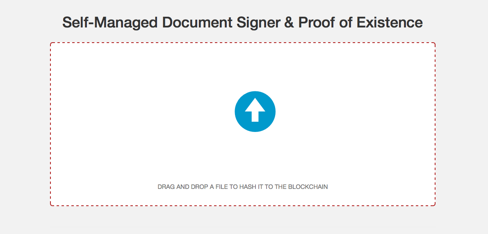

Blockstrap Blockchain File Uploader
===================================

The Blockchain File Uploader allows you to store hashes of file contents to any of the eight blockchains supported by the Blockstrap [API](http://docs.blockstrap.com/en/api/) and [PHP SDK](http://github.com/blockstrap/blockstrap-php/). For those chains with an `op_return` limit of more than 40 bytes, and at an extra cost to the user, it is also possible to upload the file to Amazon S3 (with an optional password) and also encode that additional information into the transactions `op_return`.

The configuration file (__config.ini__) is required at the root (parent of htdocs) and should contain:

```
[aws]
key = ADD_YOUR_S3_API_KEY_HERE
secret = ADD_YOUR_S3_API_SECRET_HERE
bucket = ADD_THE_BUCKET_NAME_ALREADY_CREATED_HERE

[urls]
image = http://this-domain.com/php/image.php

[salts]
file_hash = XXX

[addresses]
btc = 1GjHvbkCyYpy3uaNPvHsxe2EptH2RxEvMt
dash = Xhp3RfQKVCsqju3VEcHuMwcMPNbLszEGJG
doge = DJHXpkQGcRydRvocWaeUtZir6c2pXHkUn4
ltc = LbGtaXcsPDQpU6pA8k3sTDmCaG5qFUPAhP
btct = miNyrRGBZkyVxw1RoKMLpEagCcftVQJD22
dasht = y67MSj12Wm9YJA4291VPpnC8pGS128tH4J
doget = ncq5H5EdCwmGVtQtquk2TKyXDTNApoDpwq
ltct = moyssLnSTs6EBWDoyRMaXkUKnDmLCSXBte
```

__Do NOT forget to change the `urls` to match your domain.__

The `aws` settings are used to upload files.

The `salts` allow you to add network specific hashing.

The `addresses` are used recieve payments for uploads and logging credentials.

-----

Upon configuring things correctly, you should see the following:

[](http://uploads.blockstrap.com)

Please visit our working [demo](http://uploads.blockstrap.com) to see it in action.

-----

For more information, please visit [docs.blockstrap.com](http://docs.blockstrap.com/en/applications/uploads/).